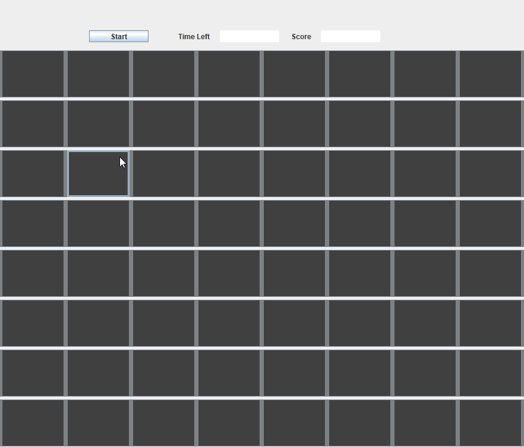

# Whack A Mole by Java Swing
## How to play
- You always have 20 seconds to hit the green button, meaning a mole has come out
- Once you hit the mole, the button would turn red
- The score is recorded
- After one round is over, you have to wait 10 seconds before you can click 'start' button again. Then the game would restart and you can keep hitting for fun

